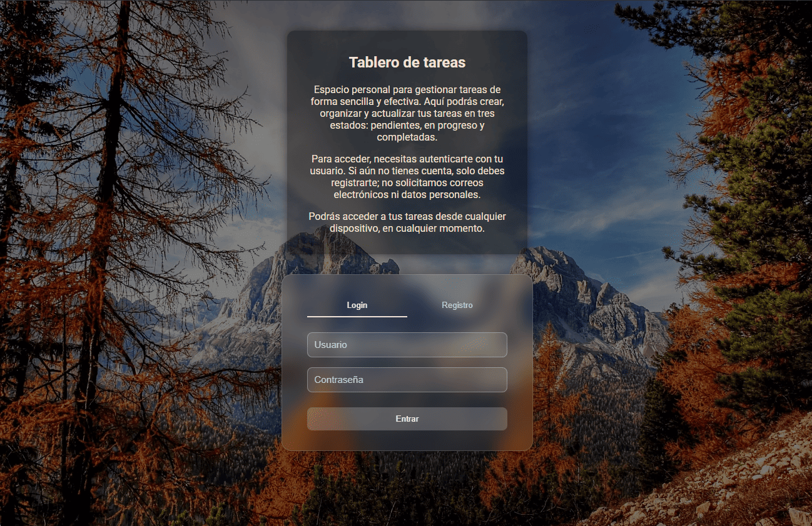
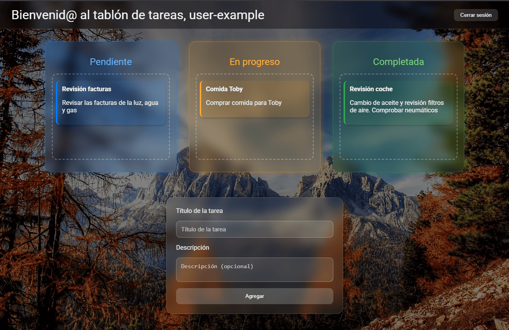

# ✅ ToDo App estilo Trello

> Aplicación de gestión de tareas con autenticación de usuarios y tablero interactivo estilo Trello.



## 📝 Descripción

**ToDo App estilo Trello** es una aplicación web que permite a los usuarios gestionar sus tareas de forma visual y ordenada mediante un sistema de columnas (tablero kanban). Cada tarea puede moverse fácilmente entre los estados de **Pendiente**, **En progreso** y **Completada** mediante la funcionalidad de **arrastrar y soltar**.

La aplicación cuenta con autenticación de usuarios mediante **JWT**, registro simple (solo usuario y contraseña), y almacenamiento persistente de datos en **MongoDB**.

---

## 🚀 Funcionalidades

- 🔐 Sistema de autenticación con JWT (login y registro)
- 📌 Registro de tareas personalizadas
- 🧩 Tablero kanban con columnas por estado
- 🖱️ Drag & Drop para mover tareas entre estados
- 🌐 Almacenamiento persistente de usuarios y tareas en MongoDB
- 🔄 Interfaz reactiva sin recarga de página

---

## 🛠 Tecnologías utilizadas

### Frontend
- **HTML5 / CSS3 / JavaScript**
- **Drag & Drop API nativa**

### Backend
- **Node.js**
- **Express**
- **MongoDB (Mongoose)**
- **JWT (JSON Web Tokens)**

---

## 📦 Instalación

```bash
# Clona el repositorio
git clone https://github.com/Gagoxyz/todo-app.git

# Entra en el directorio
cd todo-app

# Instala las dependencias
npm install

# Crea un archivo .env con las siguientes variables
touch .env
```

Ejemplo del contenido de `.env`:

```
PORT=3000
MONGO_URI=mongodb://localhost:27017/todoapp
JWT_SECRET=tu_clave_secreta
```

```bash
# Inicia el servidor
npm start
```

La aplicación estará disponible en `http://localhost:3000`.

---

## 🌐 Uso

1. Accede a `http://localhost:3000`.
2. Regístrate como nuevo usuario (solo necesitas nombre de usuario y contraseña).
3. Inicia sesión con tus credenciales.
4. Comienza a crear tareas en el dashboard.
5. Usa el sistema drag & drop para mover las tareas entre columnas según su estado.

---

## 📁 Estructura del proyecto

```
├── public/
│   ├── assets/
│   │   └── images/miniaturas/
│   ├── index.html           # Login y registro
│   └── dashboard.html       # Interfaz principal de tareas
├── server/
│   ├── controllers/
│   ├── models/
│   ├── routes/
│   ├── middleware/
│   └── server.js
├── .env
├── package.json
└── README.md
```

---

## ✨ Capturas

### 🔐 Login / Registro


### 🧩 Dashboard estilo Trello


---

## 🤝 Contribuciones

¿Tienes ideas o mejoras? ¡Eres bienvenido! Abre un [issue](https://github.com/Gagoxyz/todo-app/issues) o envía un pull request para colaborar.

---

## 🧠 Autor

Desarrollado por **[Gagoxyz](https://github.com/Gagoxyz)** – ¡Gestión de tareas simple y eficiente!

